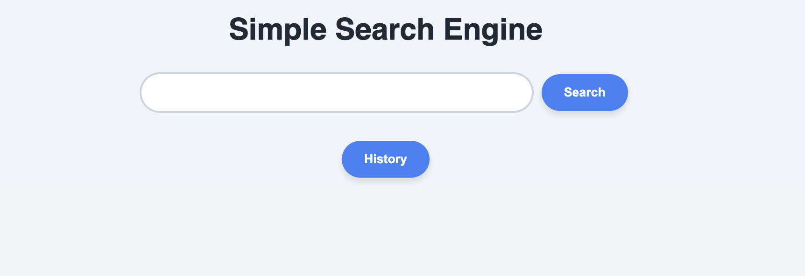
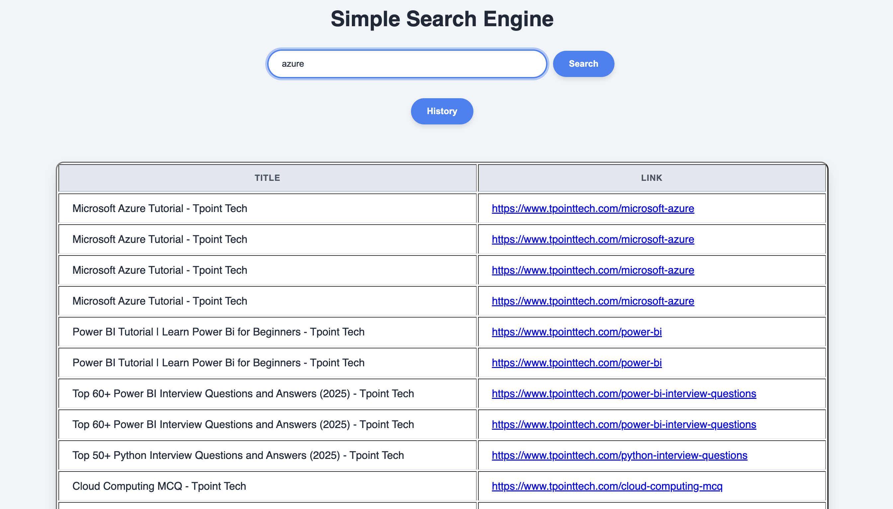
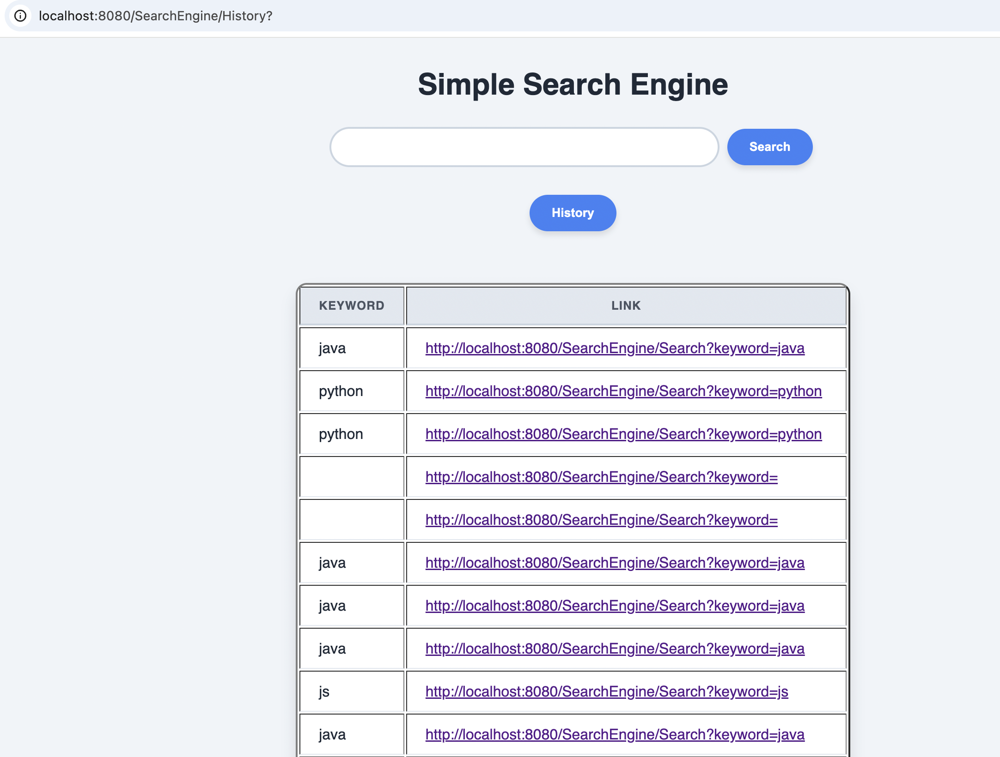

This is a brief `README.md` file for the `SearchEngine` GitHub repository. Since the repository content was not accessible for specific details, the description is based on common features of a software search engine project.

The screenshot section uses standard GitHub Markdown syntax to link to files assumed to be inside the `screenshots` folder. You may need to adjust the image file names (`search_interface.png`, etc.) to match the actual files in your directory.

````markdown
# SearchEngine 🔎

## Project Overview
This repository contains a custom implementation of a **Search Engine**. The project is designed to demonstrate the fundamental processes of information retrieval, including **web crawling/data collection**, **indexing**, **query processing**, and **ranking** results by relevance.

The engine aims to provide a functional example of how documents are collected, structured into an inverted index, and served to a user via a simple interface.

---

## Key Features
* **Data Acquisition:** A crawler or script to ingest data from specified sources (webpages, files, etc.).
* **Inverted Indexing:** Creation of an efficient data structure for fast term lookup.
* **Relevance Ranking:** An algorithm (such as TF-IDF or a variation of PageRank) to score and order search results.
* **Query Interface:** A simple web-based or command-line tool for users to input search queries.

---

## Technologies Used
*(Placeholder: Update this section with your actual tech stack)*
* **Backend:** Python / Java / Node.js
* **Database:** SQLite / MongoDB
* **Frontend:** HTML, CSS, JavaScript, (e.g., Flask/Django/Express template engine)

---

## Installation and Setup

1.  **Clone the repository:**
    ```bash
    git clone [https://github.com/anirudhsom123/SearchEngine.git](https://github.com/anirudhsom123/SearchEngine.git)
    cd SearchEngine
    ```
2.  **Install Dependencies:**
    ```bash
    # Example for Python:
    pip install -r requirements.txt
    ```
3.  **Run the Indexer/Crawler:**
    *(Steps will vary based on project structure)*
    ```bash
    python run_indexer.py
    ```
4.  **Start the Server:**
    ```bash
    python app.py
    # Access the search engine at http://localhost:5000 (or similar)
    ```

---

## Screenshots
Visual aids for the project, demonstrating the interface and key functionality.

| Search Interface | Search Results Page |
| :---: | :---: |
|  |  |
| **Indexing Console Output** | **Project Dashboard/Stats** |
|  |

***
*Note: Ensure the image file names in the markdown above exactly match the files in your `screenshots/` directory.*
````
